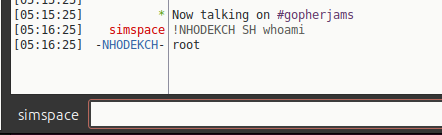

# KAITEN / TSUNAMI Malware

Kaiten is a Trojan horse that opens a back door on the compromised
computer that allows it to perform other malicious activities. The
trojan does not create any copies of itself. This backdoor arrives 
on a system as a file dropped by other malware or as a file downloaded
unknowingly by users when visiting malicious sites. It requires manual
installation. The malware is most often used as a DDoS bot and communicates
with attackers through IRC.

## Apline-Kaiten
In this directory, you will find alpine-kaiten.tar which is a Docker Alpine
Linux container that has been infected with the malware. To specify the 
callback IP, set the KAITEN_SERVER environment variable in the container.

## Attacker setup
Using the attacking VM, you will need to install an IRC server and client.
- Install ngircd:
  1. ```git clone https://github.com/ngircd/ngircd.git```
  1. Install prerequisites: ```apt-get install automake autoconf```
  1. Run the insall script: ```./autogen.sh```
  1. Run the usual ```./configure; make; make install```

- Install IRC client:
  1. For example: ```apt-get install hexchat```

## Victim setup
Load the docker alpine-kaiten image onto the host. The victim container
has been infected with the malware and an openrc service has been created
start the malware on boot.

1. Run: ```sudo docker run -it alpine-kaiten sh --login```
   - NOTE: The --login uses the /etc/profile to set the KAITEN_SERVER
     environment variable when logging in interactively. You could also
     set it in a docker-compose file.

## Command and Control
1. Use the IRC client installed on the attacking machine to connect to 
   the IRC server.
1. Join the channel: ```gopherjams```

### Command Syntax
Command syntax is ```!<nickname> <command>``` where <nickname> is the IRC
nickname of the client to command.

### Commands
There are a number of commands that can be sent to a client:
```
        TSUNAMI <target> <secs>       = A PUSH+ACK flooder                    
        PAN <target> <port> <secs>    = A SYN flooder                         
        UDP <target> <port> <secs>    = An UDP flooder                        
        UNKNOWN <target> <secs>       = Another non-spoof udp flooder         
        NICK <nick>                   = Changes the nick of the client        
        GETSPOOFS                     = Gets the current spoofing             
        SPOOFS <subnet>               = Changes spoofing to a subnet          
        DISABLE                       = Disables all packeting from this bot  
        ENABLE                        = Enables all packeting from this bot   
        KILL                          = Kills the knight                      
        GET <http address> <save as>  = Downloads a file off the web          
        VERSION                       = Requests version of knight            
        KILLALL                       = Kills all current packeting           
        HELP                          = Displays this                         
        IRC <command>                 = Sends this command to the server      
        SH <command>                  = Executes a command 
```

### Example Command
Screenshot from the working PoC
- 